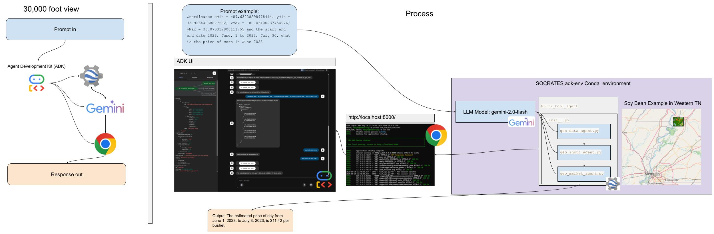
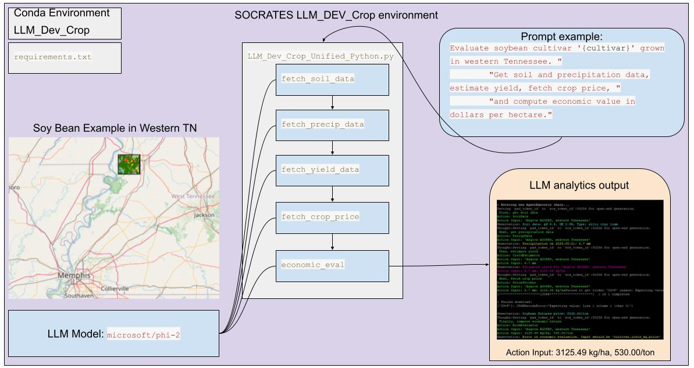

# LLM_Dev_Crop

This LLM Dev git has three approaches 

1-multi_tool_agent
Using Google ADK, google earth engine, and gemini to orchestrate multiple agent tools. All is conducted in the cloud
This approach uss an interactive UI with ADK
This is a multi tool approach to esitmate crop commodity price

2-Local_Phi_Approach
This approach runs the microsoft Phi-2 model that is hosted locally.

This is a multi tool approach to esitmate crop commodity price

3-Open_AI_Approach
This approach used the Open-AI CHat GPT PAI to run inerence in the cloud using COLAB.
Development haulted due to costs